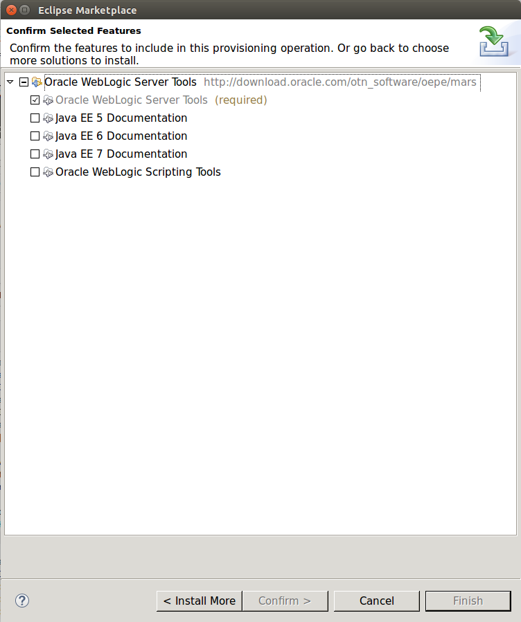

# eclipse Docker Image

## Description
This docker image provides eclipse with additional plug-ins and Lombok. It's based on [iwakoshi/eclipse](https://github.com/iwakoshi/eclipse). If you don't need plug-ins or lombok use [iwakoshi/eclipse](https://github.com/iwakoshi/eclipse) instead.  
If you use this image without rebuilding [subclipse](http://subclipse.tigris.org/) is the only plug-in that is installed. To use lombok or other plug-ins you have to rebuild the image.

## Usage
```bash
#!/bin/bash

docker stop eclipse && docker rm eclipse
xhost +local:eclipse
docker run -ti --rm --name eclipse -v /home/robert/Schreibtisch/trunk_workspace:/home/eclipse/workspace:rw \
 -v /tmp/.X11-unix:/tmp/.X11-unix -v /home/robert/Schreibtisch/trunk:/home/eclipse/trunk:rw -e DISPLAY=unix$DISPLAY \
 robertbrem/eclipse --device /dev/snd
```
**IMPORTANT:** This will only add the [subclipse](http://subclipse.tigris.org/) plug-in.

### Use Lombok
To use Lombok you have to build the docker image by yourself with the following docker command:
```bash
docker build --tag=robertbrem/eclipseWithLombok --build-arg LOMBOK=1 .
```

### Add another plug-in
To add a new plug-in you have to build the docker image by yourself.  
Firt of all you have to know two things: The **repositories** and the **plug-in name**.  
You have to extend the `eclipseInput.json` file with this information.  
Then you can build the docker image by yourself:
```bash
docker build --tag=robertbrem/eclipseWithLombok .
```
Or with Lombok enabled:
```bash
docker build --tag=robertbrem/eclipseWithLombok --build-arg LOMBOK=1 .
```

If you have a closer look at this file you will notice that it is a json array in an array, literally a map. For each entry the `Dockerfile` calls an install plug-in command. An entry consists of the two already mentioned parts (repositories and plug-in name). The initial `eclipseInput.json` file from this repository contains the entries to use [subclipse](http://subclipse.tigris.org/). It needs three plug-ins.

#### How to find out the repositories and the plug-in name
In the following i describe my way to find out the repositories and plug-in names. If you have a better solution please contact me or create a pull request.

##### Add plug-in in eclipse
Go to `Help - Eclipse Marketplace` and search for your plug-in. Then install it over the Marketplace.


After the installation you have to go to `Help - About Eclipse - Installation Details`. In the register `Installed Software` is your plug-in. In the column `Id` is the name you are looking for. In case of Weblogic Tools it's **oracle.eclipse.tools.weblogic.feature.group**.  
The next step is a little bit tricky. With the plug-in name and the link from the Marketplace (**http://download.oracle.com/otn_software/oepe/mars**) you have to search for the repository that was used. I searched in Google for: `"oracle.eclipse.tools.weblogic.feature.group" site:download.oracle.com`. One of the first results brought me directly in the repository. If you navigate to the index you get here: http://download.oracle.com/otn_software/oepe/12.2.1/mars/repository. Now click on `browse`
TBD: site currently offline  
TDB: search for repositories  
To test if you have found the correct repository you can list all plug-ins from this repository with the following command:
```bash
./eclipse -nosplash -application org.eclipse.equinox.p2.director -repository http://download.oracle.com/otn_software/oepe/12.2.1.2/mars/repository -list
```
If you find the name of plug-in in this list you are perfectly right. Some plug-ins have dependencies which are in different repositories. You have to add this repositories as well. What I did with Weblogic Tools was to try to install the plug-in with the following command:
```bash
./eclipse -nosplash -application org.eclipse.equinox.p2.director -repository http://download.oracle.com/otn_software/oepe/12.2.1.2/mars/repository -installIU oracle.eclipse.tools.weblogic.feature.group
```
If the installation fail, the missing plug-in name is displayed in the error. Then I searched this plug-in in the referenced dependencies (http://download.oracle.com/otn_software/oepe/12.2.1/mars/content.html) and added the found repository to the installation command. I ended up with the following working installation command for the Weblogic Tools plug-in:
```bash
./eclipse -nosplash -application org.eclipse.equinox.p2.director -repository http://download.oracle.com/otn_software/oepe/library/eclipse-sapphire-9.0.4,http://download.oracle.com/otn_software/oepe/library/jersey-1.17.1-p002,http://download.oracle.com/otn_software/oepe/library/jackson-1.9.13,http://download.oracle.com/otn_software/oepe/12.2.1.2/mars/repository -installIU oracle.eclipse.tools.weblogic.feature.group
Java HotSpot(TM) 64-Bit Server VM warning: ignoring option MaxPermSize=256m; support was removed in 8.0
org.eclipse.m2e.logback.configuration: The org.eclipse.m2e.logback.configuration bundle was activated before the state location was initialized.  Will retry after the state location is initialized.
Installing oracle.eclipse.tools.weblogic.feature.group 8.6.0.201602091418.
Operation completed in 124687 ms.
```
Now I have all the needed information and can create a new json entry in the `eclipseInput.json` file:
```json
[
    [ 'http://download.oracle.com/otn_software/oepe/library/eclipse-sapphire-9.0.4,http://download.oracle.com/otn_software/oepe/library/jersey-1.17.1-p002,http://download.oracle.com/otn_software/oepe/library/jackson-1.9.13,http://download.oracle.com/otn_software/oepe/12.2.1.2/mars/repository', 'oracle.eclipse.tools.weblogic.feature.group' ],
    [ 'http://subclipse.tigris.org/update_1.10.x', 'org.tigris.subversion.subclipse.feature.group' ],
    [ 'http://subclipse.tigris.org/update_1.10.x', 'org.tigris.subversion.clientadapter.feature.feature.group' ],
    [ 'http://subclipse.tigris.org/update_1.10.x', 'org.tigris.subversion.clientadapter.svnkit.feature.feature.group' ]
]
```

**HINT:** Sometimes the repositories are not only really slow they are also down.

## Tested with
* [subclipse](http://subclipse.tigris.org/)
 * http://subclipse.tigris.org/update_1.10.x : org.tigris.subversion.subclipse.feature.group
 * http://subclipse.tigris.org/update_1.10.x : org.tigris.subversion.clientadapter.feature.feature.group
 * http://subclipse.tigris.org/update_1.10.x : org.tigris.subversion.clientadapter.svnkit.feature.feature.group
* [Weblogic Tools](http://www.oracle.com/technetwork/developer-tools/eclipse/overview/weblogicservertools-161590.html)
 * http://download.oracle.com/otn_software/oepe/library/eclipse-sapphire-9.0.4,http://download.oracle.com/otn_software/oepe/library/jersey-1.17.1-p002,http://download.oracle.com/otn_software/oepe/library/jackson-1.9.13,http://download.oracle.com/otn_software/oepe/12.2.1.2/mars/repository : oracle.eclipse.tools.weblogic.feature.group

## FAQ
### Why do I have to rebuild the image and can't use environment variables on startup?
The installation especially the downloading of the plug-in can take very long. If you have to wait 30 or more minutes to start eclipse the image will be useless.
